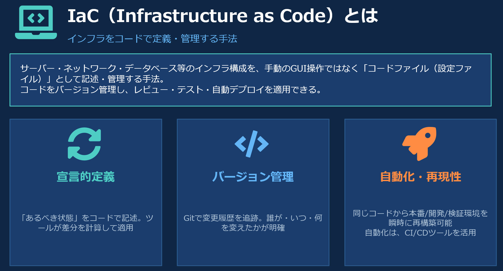

# TerraformによるIaCハンズオン
## Terrformについて
- [Terraform](https://developer.hashicorp.com/terraform)はコードでインフラを定義・管理できるIaCツールです。クラウドのVM・ネットワーク・ファイアウォールなどをコマンド一つで構築・削除できます。スタートアップスクリプトと組み合わせることで、VM作成後に必要なソフトウェアを自動インストールすることも可能です。
- インフラをコードで管理するため、同じ環境を何度でも再現できます。手作業によるミスを防ぎ、構成をGitで履歴管理できます。また `terraform destroy` で作成したリソースをまとめて削除できるため、検証環境の使い捨てにも便利です。
- 2025年2月、Terraformを開発・提供しているHashiCorpを、IBMが買収しました。Terraformと並んで著名なIaCツールである「Ansible」や「OpenShift」「Red Hat Enterprise Linux」を提供するRed Hat社をIBMは2019年7月に買収済みです。

## IaCについて

## ハンズオンは、Windows環境で、VSCode（Visual Studio Code）を使って、TerraformでAWS Lightsailやさくらのクラウド上でVM起動を行う。

### 1. 必要なソフトウェアのインストール
#### 1-1. Windows用ソフトウェアパッケージマネージャー Chocolatey 
##### 管理者権限でPowerShellを起動
Set-ExecutionPolicy Bypass -Scope Process -Force; [System.Net.ServicePointManager]::SecurityProtocol = [System.Net.ServicePointManager]::SecurityProtocol -bor 3072; iex ((New-Object System.Net.WebClient).DownloadString('https://community.chocolatey.org/install.ps1'))

#### 1-2. Terraformのインストール
##### 管理者権限でPowerShellを起動
choco install terraform

Do you want to run the script?([Y]es/[A]ll - yes to all/[N]o/[P]rint): Y

#### 1-3. AWS CLIのインストール
##### 管理者権限でPowerShellを起動
choco install awscli

Do you want to run the script?([Y]es/[A]ll - yes to all/[N]o/[P]rint): Y

#### 1-4. Visual Studio Code のインストール
https://code.visualstudio.com/ からVSCodeをインストール

#### 1-5. Visual Studio Code 拡張機能 のインストール
HashiCorp Terraform を入れておく

Terraform Provider for SakuraCloudは、VM作成時にインストールするので、事前インストールはいらない。

### 2. TerraformでVM作成のハンズオン資料
| ドキュメント | 説明 |
|---|---|
| [AWS LightsailでVM作成](aws/Terraform-AWS-README.md) | Terraformを使って、AWS LighsailでVMを作成する資料 |
| [さくらのクラウドでVM作成](sakura/Terraform-Sakura-README.md) | Terraformを使って、さくらのクラウドで最小構成のVMを作成する資料 |

